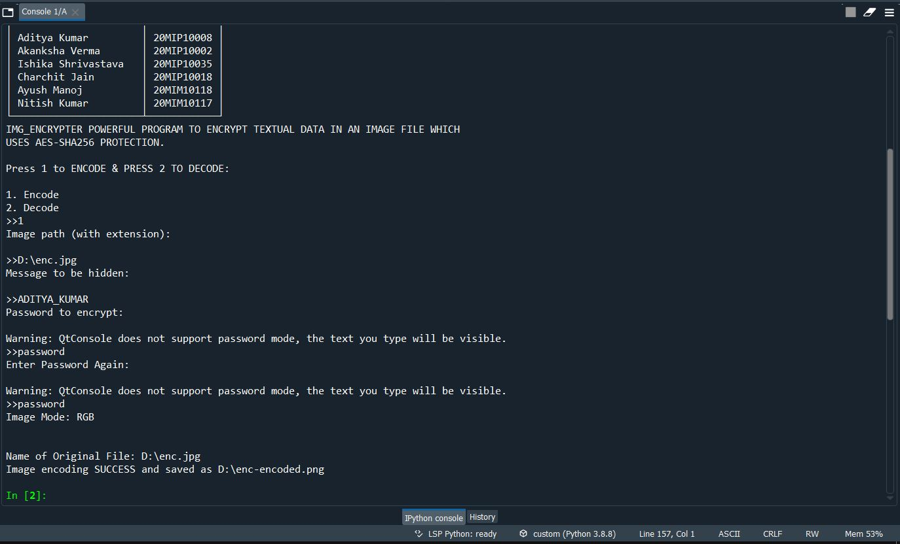

# Visual-Cryptography
This is a python Program which actually takes plain text and an image as input and encrypts it into that given message using AES-SHA-256 Encryption algo , IN SIMPLE WORDS WE CAN HIDE ANY TEXT INTO ANY IMAGE
<h1>MAIN MENU</h1>

-------------------------------------------------------------------------------------------------------------------------------------------------------

-------------------------------------------------------------------------------------------------------------------------------------------------------

<h1>ENCODING</h1>

-------------------------------------------------------------------------------------------------------------------------------------------------------

-------------------------------------------------------------------------------------------------------------------------------------------------------

<h1>DECODEING</h1>

-------------------------------------------------------------------------------------------------------------------------------------------------------

-------------------------------------------------------------------------------------------------------------------------------------------------------

ORIGINAL IMG---

Encrypted IMG---

